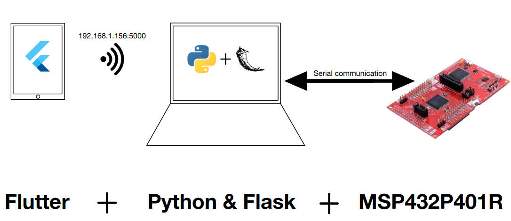
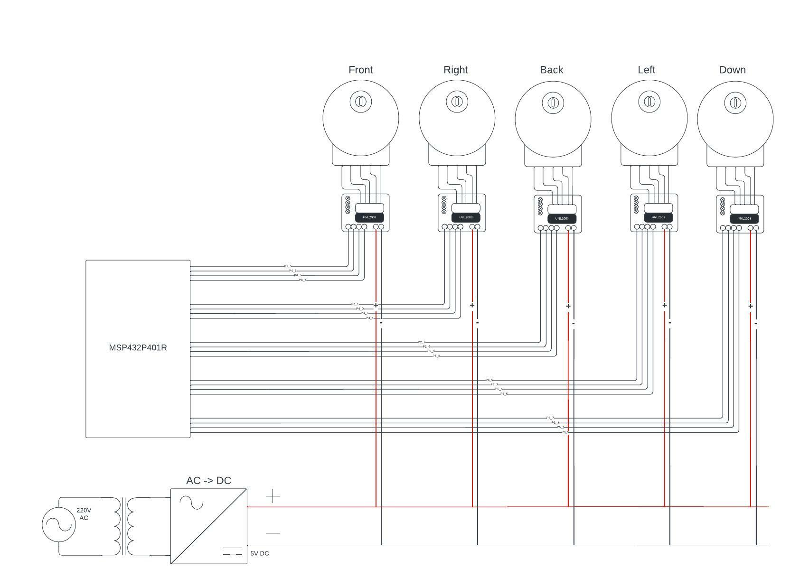

# Project for course Embedded Software for the Internet of Things

## Idea

Develop a cube solver.

We have two cubes: one locked inside the solver and a free one.

**Abstract workflow**:
1. manually scramble the free cube
2. manually scan it
3. automatically scramble the cube inside the solver to the same state
4. automatically solve it

## Project structure

Workflow:
1. scan the cube with the application
2. send cube setup to the backend
3. the backend process the solving using the [rubik-solver](https://pypi.org/project/rubik-solver/) python2 library ('Kociemba' one)
4. the solution will be adaptaded according to our moves available (only F R B L D)
5. the backend send the solution move by move to the board
6. here, depending on the command, the board move one motor for making a 90 degree turn

## Repository structure

We split each project's core in one branch:
+ **main**: project explaination
+ **stl**: 3d printer pieces
+ **flutter-app**: flutter project
+ **python-backend**: python backend for processing and serial communication 
+ **energia-board**: code uploaded on board

## Circuit

Maded with LucidChart.

## Video demonstration

